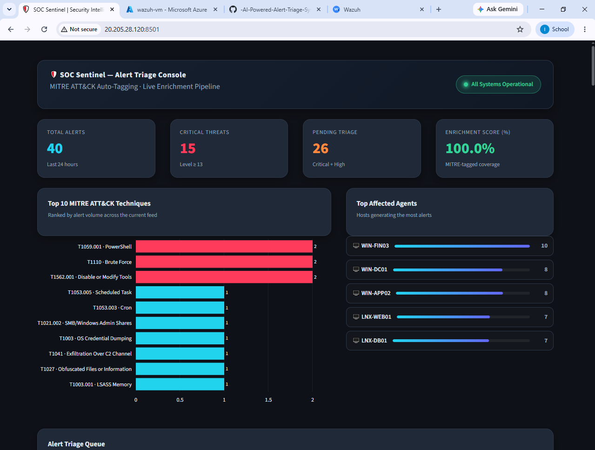
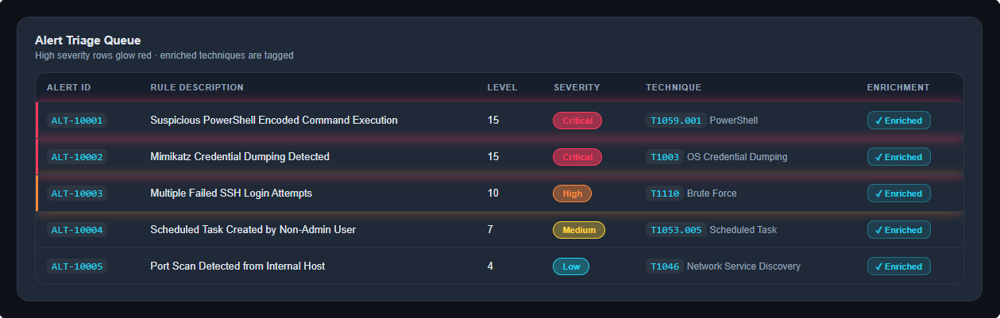
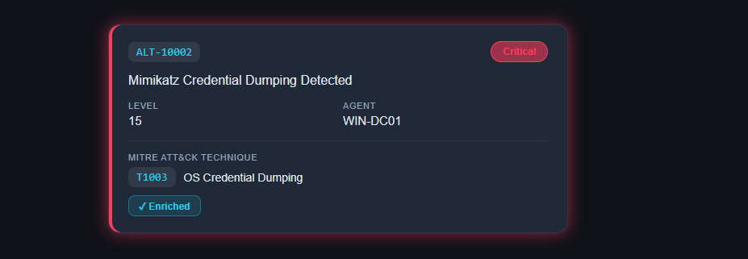
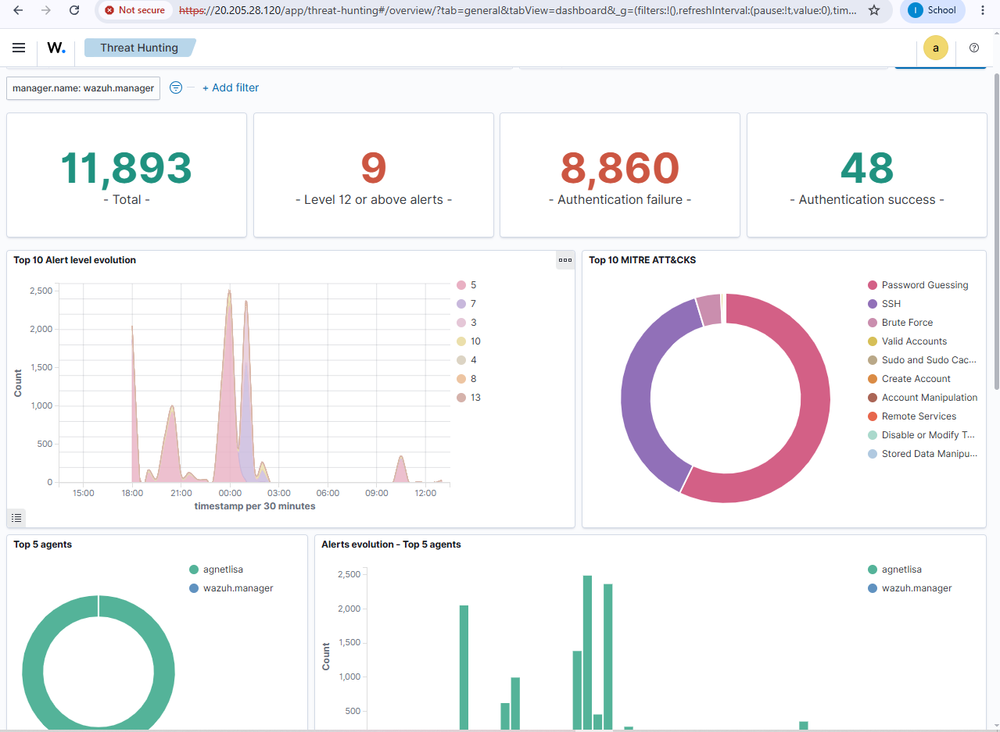

# 🛡️ SOC Sentinel — Alert Triage Dashboard with MITRE ATT&CK Auto-Tagging

A Security Operations Center (SOC) console that pulls live alerts from a **Wazuh** SIEM deployment, auto-tags each one with its **MITRE ATT&CK** technique, and renders everything in a dark-mode Streamlit dashboard built for fast triage — severity breakdown, top techniques, top affected hosts, and a full alert queue.

Deployed and tested end-to-end on a live Wazuh instance (Azure VM), ingesting real alert traffic.


---

## Demo

**SOC Sentinel — KPI overview and top techniques**


*Live KPI cards (total alerts, critical threats, pending triage, MITRE enrichment coverage), top-10 MITRE ATT&CK techniques by volume, and top affected agents — running against a real Wazuh feed with 11,893+ alerts.*

**Alert Triage Queue**


*Full alert table — severity badges, high-severity rows glow, and every enriched row is tagged with its MITRE technique ID and name.*

**A single triaged alert, close up**


*Alert ID, rule description, severity, and resolved MITRE technique (ID + name) for one row.*

**Underlying Wazuh source data**


*Wazuh's own built-in Threat Hunting view — the raw SIEM feed SOC Sentinel ingests from. MITRE tagging here comes from Wazuh's native rule engine (`rule.mitre.id`), which SOC Sentinel then pulls, re-processes, and re-presents in its own triage-focused UI.*

---

## Problem

SOC analysts spend a huge chunk of their day staring at raw alert queues — a wall of rule descriptions and severity numbers with no framework context. Knowing an alert fired is only half the picture; knowing **which adversary technique it maps to** (T1059, T1110, T1566...) is what actually drives triage priority and response.

**SOC Sentinel** closes that gap: it ingests Wazuh's alert feed, resolves every MITRE-tagged alert into a human-readable technique name and tactic, and surfaces it all in a dashboard built for fast triage instead of a raw JSON dump.

## What it does

- **Pulls alerts from a live Wazuh Indexer** (OpenSearch REST API) via `wazuh_fetcher.py`
- **Reads the MITRE ATT&CK technique ID Wazuh already assigned** to each alert (`rule.mitre.id`)
- **Enriches technique IDs** into human-readable names + tactics using a local MITRE ATT&CK reference table (`mitre_data.json`) — no external API call needed at render time
- **Maps numeric rule levels to severity labels** (Critical / High / Medium / Low / Info)
- **Visualizes everything** in a Streamlit dashboard: KPI cards, top-10 technique chart, top affected agents, and a color-coded triage queue table

## Architecture

```
Wazuh Indexer (OpenSearch)
        │  _search REST API
        ▼
 wazuh_fetcher.py  ──writes──▶  data/enriched_alerts.json
        │                              │
 mitre_data.json  ──local lookup──▶  app.py (Streamlit)
                                       │
                                       ▼
                              SOC Sentinel Dashboard
```

`wazuh_fetcher.py` queries the Wazuh Indexer directly and writes a flat JSON feed. `app.py` reads that JSON file on every load (cached), joins each `technique_id` against the local `mitre_data.json` lookup table, and renders the dashboard — no database in this deployment.

## Tech Stack

| Layer | Tool |
|---|---|
| SIEM data source | Wazuh (Indexer / OpenSearch REST API) |
| Fetch script | Python + `requests` |
| Threat framework data | MITRE ATT&CK Enterprise (local JSON, `mitre_data.json`) |
| Data processing | Pandas |
| Dashboard | Streamlit |
| Charts | Plotly |

## Repo structure

```
.
├── app.py                     # Streamlit dashboard — layout, styling, data logic
├── wazuh_fetcher.py            # CLI script: pulls alerts from a live Wazuh Indexer
├── mitre_data.json             # Local MITRE ATT&CK technique -> {name, tactic} lookup
├── data/
│   └── enriched_alerts.json    # Alert feed the dashboard reads (written by wazuh_fetcher.py)
├── .streamlit/
│   └── config.toml             # Dark theme + server config
└── pyproject.toml / uv.lock    # Dependencies
```

## Alert schema

Every alert in `data/enriched_alerts.json` follows this shape:

```json
{
  "alert_id": "string",
  "rule_description": "string",
  "level": 12,
  "technique_id": "T1110",
  "agent_name": "WIN-FIN03"
}
```

`technique_id` is set to `"UNCLASSIFIED"` if the underlying Wazuh rule has no MITRE mapping.

## Getting Started

### 1. Clone and install

```bash
git clone https://github.com/tareksec/-AI-Powered-Alert-Triage-System-with-MITRE-ATT-CK-Auto-Tagging.git
cd -AI-Powered-Alert-Triage-System-with-MITRE-ATT-CK-Auto-Tagging
pip install -r requirements.txt   # or: uv sync
```

### 2. Point it at your Wazuh deployment

Set your Wazuh Indexer credentials as environment variables:

```bash
export WAZUH_INDEXER_URL="https://<your-wazuh-host>:9200"
export WAZUH_INDEXER_USER="admin"
export WAZUH_INDEXER_PASSWORD="your-password"
```

Then run:

```bash
python wazuh_fetcher.py --output data/enriched_alerts.json --size 500 --min-level 3
```

This queries the Wazuh Indexer's `_search` endpoint, maps each hit into the schema above, and writes it to `data/enriched_alerts.json`. If you skip this step, the dashboard will just read whatever sample data is already in `data/enriched_alerts.json`.

### 3. Run the dashboard

```bash
streamlit run app.py --server.port 8501
```

Open `http://localhost:8501` in your browser.

## Dashboard features

- **KPI row** — total alerts, critical threats, pending triage (Critical + High), and MITRE enrichment coverage %
- **Top 10 MITRE ATT&CK Techniques** — horizontal bar chart ranked by alert volume
- **Top Affected Agents** — which hosts are generating the most alerts
- **Alert Triage Queue** — full table, high-severity rows glow, enriched rows tagged with a badge

## Severity mapping

| Wazuh `level` | Severity |
|---|---|
| ≥ 13 | Critical |
| ≥ 10 | High |
| ≥ 7 | Medium |
| ≥ 4 | Low |
| < 4 | Info |

## Known limitations

- **MITRE tagging is rule-based, not AI-classified.** The technique ID for each alert comes directly from Wazuh's own detection rules (`rule.mitre.id`) — SOC Sentinel enriches and displays it, but doesn't independently decide the technique.
- **No real-threat vs. false-positive classification yet.** The dashboard shows every alert Wazuh reports above the configured level; it doesn't currently score or filter for likely false positives.
- **`data/enriched_alerts.json` is a static snapshot**, refreshed by manually re-running `wazuh_fetcher.py` — there's no live polling or auto-refresh yet.

## Roadmap

- [ ] LLM-based classification layer (real threat vs. false positive, independent severity/technique judgment) on top of the existing Wazuh-sourced MITRE tags — in progress on a PostgreSQL-backed branch (`ai_triage.py` + `database.py`, OpenAI `gpt-4o-mini`)
- [ ] Automatic mitigation recommendations per technique
- [ ] Docker Compose for one-command Wazuh + dashboard spin-up
- [ ] Scheduled `wazuh_fetcher.py` runs (cron) instead of manual invocation, or live polling

## 🛠️ Recommendations for Improvement

> The following recommendations complement the roadmap above, with a focus on **hardening the current PoC** before scaling it further.

* 🔁 **Error Handling & Retry Logic** — `wazuh_fetcher.py` and the OpenAI API calls should include structured exception handling (timeouts, rate limits, malformed responses) with **exponential backoff on retries**, so a single failed request doesn't silently drop an alert from triage.
* ✅ **Prompt Validation & Output Schema** — Since triage results feed downstream tagging, enforce a **strict JSON schema** on the LLM's output (e.g. via function calling or Pydantic validation) and reject/re-prompt on malformed responses, rather than trusting free-text output.
* 🧾 **Logging & Audit Trail** — Add **structured logging** (JSON logs with timestamps, alert IDs, and model responses) so every triage decision is traceable — this is a baseline requirement for any SOC tool and will matter a lot if auto-remediation is added later.
* 🔐 **Secrets Management** — Ensure API keys (OpenAI, Wazuh) are loaded from **environment variables** or a secrets manager, never hardcoded or committed, and add a `.env.example` file to the repo for onboarding.
* 🧪 **Unit & Integration Tests** — A small test suite (e.g. `pytest`) covering the fetcher, the tagging logic, and edge cases (empty alerts, API failures) would significantly increase **confidence for anyone evaluating or contributing** to the project.
* ⚡ **Rate Limiting & Caching** — Cache MITRE ATT&CK technique lookups and **deduplicate near-identical alerts** before sending them to the API, reducing redundant calls and cost even before full batch processing is implemented.
* ⚙️ **Configuration File** — Move hardcoded values (model name, thresholds, polling interval) into a single `config.yaml` or `.env` file to make the system **easier to tune without touching code**.
* 🧑‍💻 **Human-in-the-Loop Safeguard** — When auto-remediation is added, gate any firewall/blocking action behind **explicit analyst approval by default**, with auto-execution reserved for a narrowly scoped allow-list of low-risk actions.

> 💡 **Why it matters:** these are incremental, low-effort additions that would strengthen the project's reliability and make it easier for reviewers, contributors, or hiring managers to evaluate the **engineering rigor** behind the PoC.

